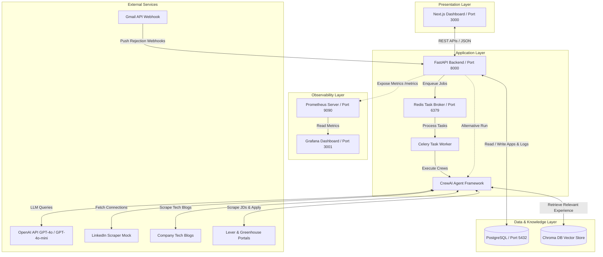
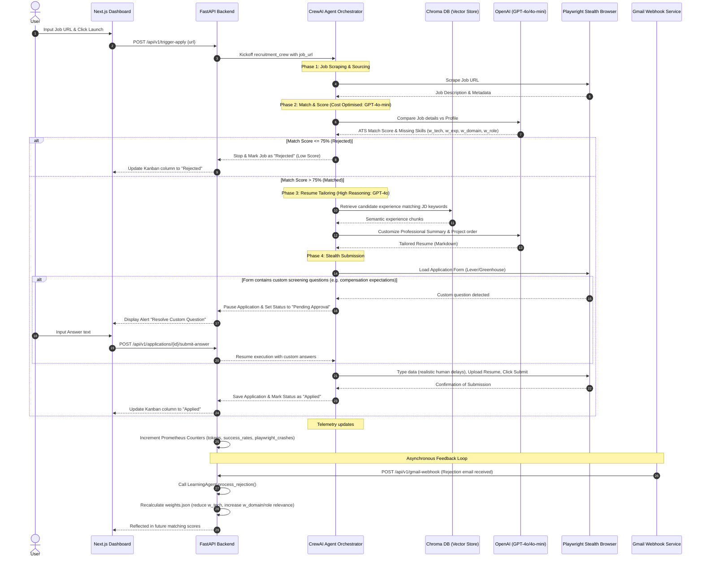

# CrewAI Auto-Apply Core: Technical Architecture & Usage Guide

This document provides a comprehensive breakdown of the **CrewAI Auto-Apply Core (ATS & Pipeline Automation)** project, including its system architecture, step-by-step sequential flows, and instructions on how to use the system as an end user.

---

## 1. Technical Architecture Diagram

The system follows a microservices-based design with an agentic orchestrator (CrewAI), an asynchronous processing layer (Celery/Redis), vector search (Chroma DB), and monitoring instrumentation (Prometheus/Grafana).

### Components Description

*   **Next.js Dashboard**: A responsive, Tailwind CSS-powered UI that acts as the user control center. It represents the application pipeline as a visual Kanban board.
*   **FastAPI Backend**: The gateway API handling HTTP requests, webhooks (e.g., Gmail rejections), background task scheduling, and serving data to the UI.
*   **Celery & Redis**: An asynchronous queueing system to run resource-heavy browser automation processes and multi-agent runs without blocking the API threads.
*   **CrewAI Framework**: Coordinates specialised AI agents to perform complex, sequential workflows:
    *   **Principal Job Sourcing Specialist**: Discovers job descriptions.
    *   **Technical ATS Scorer**: Ranks jobs based on semantic fit and candidate experience.
    *   **Executive Resume Tailor**: Customizes specific parts of the resume.
    *   **Playwright Automation Specialist**: Emulates human behavior (delays, mouse movements, stealth headers) to submit forms.
    *   **Network Mapping Specialist**: Identifies referrals via LinkedIn.
    *   **Interview Prep Specialist**: Researches technical blog postings to draft study guides.
*   **PostgreSQL**: Relational database storing structured details about jobs, application statuses, logs, referral drafts, and interview preps.
*   **Chroma DB**: A vector store holding chunked embeddings of the candidate's master resume for context retrieval during resume tailoring and question resolution.
*   **Prometheus & Grafana**: Collects and visualizes live telemetry (LLM token consumption rates, success/failure metrics, and automation crash reasons).

---

## 2. Sequential Workflow Diagram

Below is the execution flow from the moment an application is triggered down to the automatic application submission and potential learning updates.

---

## 3. End-User Guide (How to Use)

### A. Setting Up Your Profile
1.  **Configure Environment**: Set your API credentials in your `.env` file (e.g., `OPENAI_API_KEY`, mock/real `LINKEDIN_COOKIES`).
2.  **Upload Master Resume**: Place your master resume in the root directory (named `resume.pdf`). The system uses `core/rag.py` to ingest and split this resume, storing the embeddings in `./chroma_db`.

### B. Accessing the Services
Ensure Docker Compose is running (`docker-compose up --build`).
*   **Web Dashboard**: Open [http://localhost:3000](http://localhost:3000)
*   **API Docs (Swagger)**: Open [http://localhost:8000/docs](http://localhost:8000/docs)
*   **Telemetry Dashboards**: Open Grafana at [http://localhost:3001](http://localhost:3001) (User: `admin` / Password: `admin`) to monitor token costs and Playwright crashes.

### C. Triggering an Auto-Apply Run
1.  Navigate to the **Web Dashboard** (`localhost:3000`).
2.  Locate the top bar section labeled **"Trigger Autonomous Apply Flow"**.
3.  Paste a target job application URL (e.g., Greenhouse or Lever job post) into the input field.
4.  Click **Launch**.
5.  The system starts the pipeline:
    *   It scrapes the JD, evaluates the match score, and places the job in the **Found** column.
    *   As the score is determined, it moves to the **Scored** column.
    *   If matched, the resume tailor runs, moving the job to **Tailoring**.

### D. Resolving Pending Approvals (Manual Intervention)
If the application form features custom text questions that AI cannot answer confidently without authorization (such as salary expectations or authorization status):
1.  The card will move to the **Pending Approval** column.
2.  The card will display a warning: **"Resolve Custom Question"**.
3.  Click this button to open the modal.
4.  Review the question asked by the application form and type your custom answer.
5.  Click **Resume & Apply**. The Playwright browser agent resumes automatically, fills the answer into the page, and completes the submission.

### E. Getting Referrals and Interview Prep Sheets
Once a job is in the **Applied** status, you can trigger post-application workflows:
1.  **Generate Networking Referrals**:
    *   Click on the application card in the dashboard or trigger the POST endpoint `/api/v1/applications/{app_id}/referrals`.
    *   The **Network Mapping Agent** queries your LinkedIn connections to draft personalized outreach messages in Markdown format.
2.  **Generate Interview Prep Guides**:
    *   Schedule an interview by clicking the interview scheduling prompt or hitting POST `/api/v1/applications/{app_id}/schedule-interview` with an interview date and time.
    *   The **Interview Prep Specialist** scrapes the target company's engineering blogs.
    *   It extracts architectural highlights (e.g. migration stories, technical stacks) and outputs a comprehensive preparation document.
